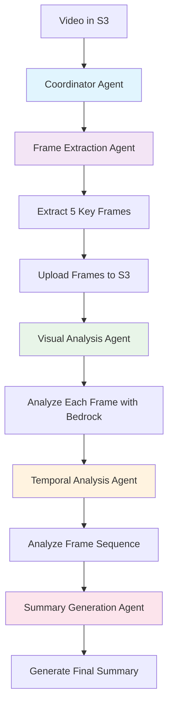

# 🎬 Multi-Agent Video Processing with Llama 4

Processes videos stored in S3 using AI agents to extract frames, analyze content, and generate summaries.

## 📋 Prerequisites

- ☁️ AWS Account
- 🤖 Amazon Bedrock access enabled
- 🔧 Strands Agents SDK
- 🐍 Python 3.9+

## 🚀 Installation

1. **📦 Install Python dependencies:**
```bash
pip install -r requirements.txt
```

2. **🔓 Enable Llama 4 models in Bedrock:**
Go to AWS Console → Bedrock → Model access and enable:
- `us.meta.llama4-maverick-17b-instruct-v1:0`
- `us.meta.llama4-scout-17b-instruct-v1:0`

## 🏗️ System Architecture



## 💻 Usage

### Option 1: 📓 Jupyter Notebook

1. **🚀 Start Jupyter:**
```bash
jupyter notebook agentic_video_processing_with_llama_4.ipynb
```

2. **📤 Upload a video to S3:**
The notebook uses your default SageMaker S3 bucket: `sagemaker-{region}-{account_id}`

3. **🔧 Run the upload function:**
```python
local_video_path = "path/to/your/video.mp4"
s3_video_uri = upload_to_sagemaker_bucket(local_video_path)
```

4. **⚡ Process the video:**
```python
response = llama4_coordinator_agent(f"Process a video from {s3_video_uri}")
```

### Option 2: 🌐 Gradio Web Interface

1. **🚀 Start the web app:**
```bash
python gradio_app.py
```

2. **🌍 Open browser:** Go to `http://localhost:7860`

3. **📁 Upload video:** Drag and drop your video file

4. **⏳ Wait for processing:** The system will automatically:
   - 📤 Upload video to S3
   - 🎞️ Extract frames
   - 🔍 Analyze content
   - 📝 Generate summary

## ⚙️ How It Works

### 🤖 Agent Workflow

1. **🎯 Coordinator Agent** (Llama 4)
   - Orchestrates the entire workflow
   - Calls other agents in sequence

2. **🎞️ Frame Extraction Agent** (Llama 4)
   - Downloads video from S3
   - Extracts 5 key frames using OpenCV
   - Uploads frames back to S3

3. **👁️ Visual Analysis Agent** (Llama 4)
   - Downloads each frame
   - Analyzes visual content using Bedrock vision
   - Generates descriptions for each frame

4. **⏰ Temporal Analysis Agent** (Llama 4)
   - Analyzes sequence of events across frames
   - Identifies transitions and narrative flow

5. **📄 Summary Generation Agent** (Llama 4)
   - Combines visual and temporal analysis
   - Creates final video summary

### 🗂️ S3 Bucket Structure

```
sagemaker-{region}-{account_id}/
├── videos/
│   └── video-name/
│       ├── video-name.mp4           # 🎬 Original video
│       ├── video-name_frames_*/     # 🖼️ Extracted frames folder
│       │   ├── frame_1.jpg
│       │   ├── frame_2.jpg
│       │   └── ...
│       └── analysis_results.json    # 📊 Analysis output
```

## 🔐 Required AWS Permissions

Your AWS user/role needs these permissions:

```json
{
    "Version": "2012-10-17",
    "Statement": [
        {
            "Effect": "Allow",
            "Action": [
                "bedrock:InvokeModel",
                "s3:GetObject",
                "s3:PutObject",
                "s3:ListBucket"
            ],
            "Resource": [
                "arn:aws:bedrock:*:*:foundation-model/*",
                "arn:aws:s3:::sagemaker-*",
                "arn:aws:s3:::sagemaker-*/*"
            ]
        }
    ]
}
```

## 🔧 Troubleshooting

**❌ Error: "Model not found"**
- Enable the required Llama 4 models in Bedrock console
- Check if models are available in your region

**❌ Error: "Access denied to S3"**
- Verify AWS credentials are configured
- Check S3 permissions for SageMaker bucket

**⚠️ Error: "Throttling"**
- The system includes automatic retry logic
- Wait and try again if processing fails

**❌ Error: "Video format not supported"**
- Supported formats: MP4, AVI, MOV
- Convert video to MP4 if needed

## 📁 File Structure

```
├── agentic_video_processing_with_llama_4.ipynb  # 📓 Main notebook
├── gradio_app.py                                # 🌐 Web interface
├── requirements.txt                             # 📦 Dependencies
├── s3_frame_extraction_agent.py                 # 🎞️ Frame extraction
├── s_visual_analysis_agent.py                   # 👁️ Visual analysis
├── c_temporal_analysis_agent.py                 # ⏰ Temporal analysis
├── summary_generation_agent.py                  # 📄 Summary generation
├── llama4_coordinator_agent.py                  # 🎯 Workflow coordination
└── retrieve_json.py                             # 🔧 Utility functions
```

## ⚡ Performance Notes

- ⏱️ Processing time: 2-5 minutes per video
- 📏 Video size limit: 100MB recommended
- 🖼️ Frame extraction: Maximum 5 frames per video
- 🚦 Concurrent processing: Limited to prevent API throttling
