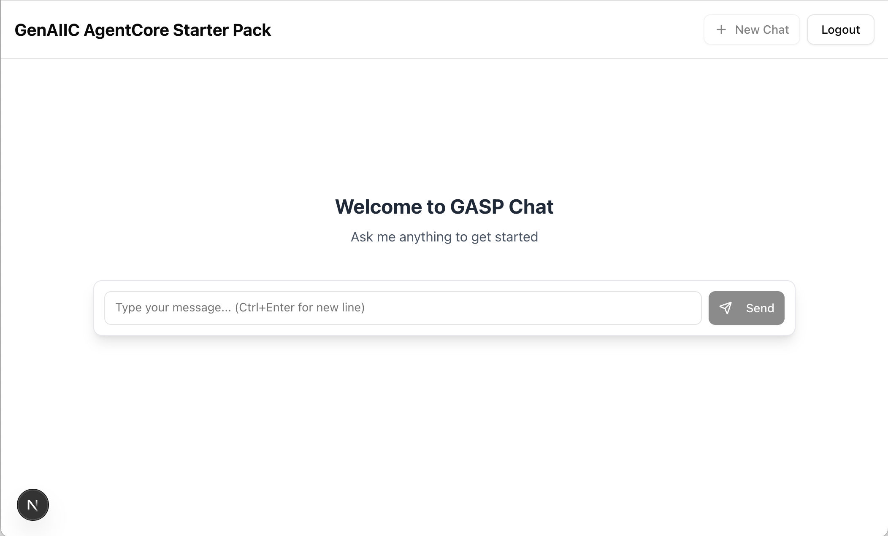

# Frontend - Local Development Guide

This is the React + Vite frontend for the Fullstack AgentCore Solution Template (FAST). This README focuses on local development setup and workflows.

For full stack deployment instructions, see the [top-level README](../README.md) and [deployment documentation](../docs/DEPLOYMENT.md).



## Local Development Setup

### Prerequisites

- Node.js (20+ recommended)
- npm

### Quick Start

1. Navigate to the frontend directory:

```bash
cd frontend
```

2. Install dependencies:

```bash
npm install
```

3. Start the development server:

```bash
npm run dev
```

4. Open [http://localhost:3000](http://localhost:3000) in your browser

## Development Options

### Option 1: With Authentication (Default)

By default, the app uses Cognito authentication. To test this locally:

1. First deploy the full stack (see [deployment docs](../docs/DEPLOYMENT.md))
2. Set the redirect URI for local development:

```bash
export VITE_COGNITO_REDIRECT_URI=http://localhost:3000
npm run dev
```

### Option 2: Disable Authentication (ONLY for Local Development!!!)

For faster local development without needing to deploy Cognito, you can disable authentication:

**⚠️ IMPORTANT: Remove the AuthProvider wrapper from `src/App.tsx`**

Change this:

```tsx
export default function App() {
  return (
    <BrowserRouter>
      <AuthProvider>
        <AppRoutes />
      </AuthProvider>
    </BrowserRouter>
  )
}
```

To this:

```tsx
export default function App() {
  return (
    <BrowserRouter>
      <AppRoutes />
    </BrowserRouter>
  )
}
```

This bypasses all authentication flows and lets you develop the UI directly.

## UI Components

This project uses [shadcn/ui](https://ui.shadcn.com/docs/components) for UI components.

### Adding New Components

Install additional shadcn components as needed:

```bash
npx shadcn@latest add calendar
npx shadcn@latest add dialog
npx shadcn@latest add form
```

### Available Components

Browse the full component library at: https://ui.shadcn.com/docs/components

Popular components include:

- Button, Input, Textarea
- Dialog, Sheet, Popover
- Table, Card, Badge
- Form, Calendar, Select
- And many more...

## Icons

This project includes [Lucide React](https://lucide.dev/) icons, providing a comprehensive set of beautiful, customizable icons.

### Using Icons

Import and use any icon from the Lucide library:

```tsx
import { Camera } from "lucide-react"

// Usage
const App = () => {
  return <Camera color="red" size={48} />
}

export default App
```

### Available Icons

Browse all available icons at: https://lucide.dev/

Popular icons include Camera, Search, Menu, User, Settings, Download, Upload, and hundreds more.

## Project Structure

```
frontend/
├── src/
│   ├── main.tsx            # Application entry point
│   ├── App.tsx             # Root component with routing
│   ├── routes/             # Route components
│   ├── components/
│   │   ├── ui/             # shadcn components
│   │   ├── chat/           # Chat UI
│   │   └── auth/           # Authentication components
│   ├── hooks/              # Custom hooks (useToolRenderer)
│   ├── lib/                # Utilities and configurations
│   │   └── agentcore-client/ # AgentCore streaming client, parsers, types
│   ├── services/           # API service layers
│   └── styles/             # Global styles
├── public/                 # Static assets
├── index.html              # HTML entry point
└── package.json
```

## Environment Variables

The application uses Vite environment variables with the `VITE_` prefix:

- `VITE_COGNITO_USER_POOL_ID` - Cognito User Pool ID
- `VITE_COGNITO_CLIENT_ID` - Cognito Client ID
- `VITE_COGNITO_REGION` - AWS Region
- `VITE_COGNITO_REDIRECT_URI` - Redirect URI after authentication
- `VITE_COGNITO_POST_LOGOUT_REDIRECT_URI` - Redirect URI after logout

These can be set in a `.env` file or as environment variables. The application will fall back to `aws-exports.json` if environment variables are not set.

## Available Scripts

- `npm run dev` - Start the Vite development server
- `npm run build` - Build for production (runs TypeScript check + Vite build)
- `npm run preview` - Preview the production build locally
- `npm run lint` - Run ESLint
- `npm run lint:fix` - Run ESLint with auto-fix
- `npm run clean` - Clean build artifacts and dependencies

## Development Tips

- **Hot Reload**: Changes auto-reload in the browser with Vite's fast HMR
- **TypeScript**: Full type safety with strict mode enabled
- **Vibe Coding**: Optimized for AI-assisted development
- **Tailwind CSS**: Utility-first styling with Tailwind CSS 4

## Building with AI Assistants

This stack is designed for AI-assisted development:

1. **Describe your vision**: "Create a document upload component with drag-and-drop"
2. **Leverage shadcn components**: Rich building blocks that AI understands
3. **Iterate quickly**: Make changes and see results instantly

### Example AI Prompts

- "Add a file upload component to the chat interface"
- "Create a sidebar with navigation using shadcn components"
- "Build a settings page with form validation"
- "Add a data table with sorting and filtering"
