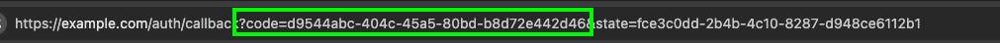

# Customer Support Agent

> [!IMPORTANT]
> The examples provided in this repository are for experimental and educational purposes only. They demonstrate concepts and techniques but are not intended for direct use in production environments.

This is a customer support agent implementation using AWS Bedrock AgentCore framework. The system provides an AI-powered customer support interface with capabilities for warranty checking, customer profile management, Google calendar integration, and Amazon Bedrock Knowledge Base retrieval.


## Table of Contents
- [Customer Support Agent](#customer-support-agent)
  - [Table of Contents](#table-of-contents)
  - [Prerequisites](#prerequisites)
    - [AWS Account Setup](#aws-account-setup)
  - [Deploy](#deploy)
  - [Sample Queries](#sample-queries)
  - [Scripts](#scripts)
    - [Amazon Bedrock AgentCore Gateway](#amazon-bedrock-agentcore-gateway)
      - [Create Amazon Bedrock AgentCore Gateway](#create-amazon-bedrock-agentcore-gateway)
      - [Delete Amazon Bedrock AgentCore Gateway](#delete-amazon-bedrock-agentcore-gateway)
    - [Amazon Bedrock AgentCore Memory](#amazon-bedrock-agentcore-memory)
      - [Create Amazon Bedrock AgentCore Memory](#create-amazon-bedrock-agentcore-memory)
      - [Delete Amazon Bedrock AgentCore Memory](#delete-amazon-bedrock-agentcore-memory)
    - [Cognito Credentials Provider](#cognito-credentials-provider)
      - [Create Cognito Credentials Provider](#create-cognito-credentials-provider)
      - [Delete Cognito Credentials Provider](#delete-cognito-credentials-provider)
    - [Google Credentials Provider](#google-credentials-provider)
      - [Create Credentials Provider](#create-credentials-provider)
      - [Delete Credentials Provider](#delete-credentials-provider)
    - [Agent Runtime](#agent-runtime)
      - [Delete Agent Runtime](#delete-agent-runtime)
  - [Cleanup](#cleanup)
  - [🤝 Contributing](#-contributing)
  - [📄 License](#-license)
  - [🆘 Support](#-support)
  - [🔄 Updates](#-updates)

## Prerequisites

### AWS Account Setup

1. **AWS Account**: You need an active AWS account with appropriate permissions
   - [Create AWS Account](https://aws.amazon.com/account/)
   - [AWS Console Access](https://aws.amazon.com/console/)

2. **AWS CLI**: Install and configure AWS CLI with your credentials
   - [Install AWS CLI](https://docs.aws.amazon.com/cli/latest/userguide/getting-started-install.html)
   - [Configure AWS CLI](https://docs.aws.amazon.com/cli/latest/userguide/cli-configure-quickstart.html)

   ```bash
   aws configure
   ```
3. **Python 3.10+**: Required for running the application
   - [Python Downloads](https://www.python.org/downloads/)

4. **Create OAuth 2.0 credentials for calendar access** : For Google Calendar integration
   - Follow [Google OAuth Setup](./prerequisite/google_oauth_setup.md)

## Deploy

1. **Create infrastructure**

    ```bash
    python3 -m venv .venv
    source .venv/bin/activate
    pip install -r dev-requirements.txt

    chmod +x scripts/prereq.sh
    ./scripts/prereq.sh

    chmod +x scripts/list_ssm_parameters.sh
    ./scripts/list_ssm_parameters.sh
    ```

    > [!CAUTION]
    > Please prefix all the resource name with `customersupport`.

2. **Test Ollama with strands locally**

    ```bash
    python3 test/test_agent_local.py
    ```
    Note: It'll return the current time in San Francisco as output using tool calling

3. **Create Agentcore Gateway**

    ```bash
    python3 scripts/agentcore_gateway.py create --name customersupport-gw
    ```

4. **Setup Agentcore Identity**

    - **Setup Cognito Credential Provider**

    ```bash
    python3 scripts/cognito_credentials_provider.py create --name customersupport-gateways

    python3 test/test_gateway.py --prompt "Check warranty with serial number MNO33333333"
    ```

    - **Setup Google Credential Provider**

    Follow instructions to setup [Google Credentials](./prerequisite/google_oauth_setup.md).

    ```bash
    python3 scripts/google_credentials_provider.py create --name customersupport-google-calendar

    python3 test/test_google_tool.py
    ```

5. **Create Memory**

    ```bash
    python3 scripts/agentcore_memory.py create --name customersupport

    python3 test/test_memory.py load-conversation
    python3 test/test_memory.py load-prompt "My preference of gaming console is V5 Pro"
    python3 test/test_memory.py list-memory
    ```

6. **Setup Agent Runtime**

> [!CAUTION]
> Please ensure the name of the agent starts with `customersupport` and replae the <AgentName> with a name for example, test.
    
  ```bash
  agentcore configure --entrypoint main.py -er arn:aws:iam::<Account-Id>:role/<Role> --name customersupport_<AgentName>
  ```

  Use `./scripts/list_ssm_parameters.sh` to fill:
  - `Role = ValueOf(/app/customersupport/agentcore/runtime_iam_role)`
  - `OAuth Discovery URL = ValueOf(/app/customersupport/agentcore/cognito_discovery_url)`
  - `OAuth client id = ValueOf(/app/customersupport/agentcore/web_client_id)`.

  

  > [!CAUTION]
  > Please make sure to delete `.agentcore.yaml` before running agentcore launch.

  ```bash

  agentcore launch

  python3 test/test_agent.py customersupport_<AgentName> -p "Hi"
  ```
Note: 
1. For the first time login, you may need to **signup** and **login** to the UI.
2. When asked for `code`, please refer to the following example, copy between `code=` and `&state` from your browser after authentication and paste as needed.

  

7. **Local Host Streamlit UI**

> [!CAUTION]
> Streamlit app should only run on port `8501`.

```bash
streamlit run app.py --server.port 8501 -- --agent=customersupport_<AgentName>
```

## Sample Queries

1. I have a Gaming Console Pro device , I want to check my warranty status, warranty serial number is MNO33333333.

2. What are the warranty support guidelines ?

3. What’s my agenda for today?

4. Can you create an event to setup call to renew warranty?

5. I have overheating issues  with my device, help me debug.

## Scripts

### Amazon Bedrock AgentCore Gateway

#### Create Amazon Bedrock AgentCore Gateway

```bash
python scripts/agentcore_gateway.py create --name my-gateway
python scripts/agentcore_gateway.py create --name my-gateway --api-spec-file custom/path.json
```

#### Delete Amazon Bedrock AgentCore Gateway

```bash
# Delete gateway (reads from gateway.config automatically)
python3 scripts/agentcore_gateway.py delete

# Delete with confirmation skip
python3 scripts/agentcore_gateway.py delete --confirm
```

### Amazon Bedrock AgentCore Memory

#### Create Amazon Bedrock AgentCore Memory

```bash
python3 scripts/agentcore_memory.py create --name MyMemory
python3 scripts/agentcore_memory.py create --name MyMemory --event-expiry-days 60
```

#### Delete Amazon Bedrock AgentCore Memory

```bash
# Delete memory (reads from SSM automatically)
python3 scripts/agentcore_memory.py delete

# Delete with confirmation skip
python3 scripts/agentcore_memory.py delete --confirm
```

### Cognito Credentials Provider

#### Create Cognito Credentials Provider

```bash
python3 scripts/cognito_credentials_provider.py create --name customersupport-gateways
```

#### Delete Cognito Credentials Provider

```bash
# Delete provider (reads name from SSM automatically)
python3 scripts/cognito_credentials_provider.py delete

# Delete specific provider by name
python3 scripts/cognito_credentials_provider.py delete --name customersupport-gateways

# Delete with confirmation skip
python3 scripts/cognito_credentials_provider.py delete --confirm
```

### Google Credentials Provider

#### Create Credentials Provider

```bash
python3 scripts/google_credentials_provider.py create --name customersupport-google-calendar
python3 scripts/google_credentials_provider.py create --name my-provider --credentials-file /path/to/credentials.json
```

#### Delete Credentials Provider

```bash
# Delete provider (reads name from SSM automatically)
python3 scripts/google_credentials_provider.py delete

# Delete specific provider by name
python3 scripts/google_credentials_provider.py delete --name customersupport-google-calendar

# Delete with confirmation skip
python3 scripts/google_credentials_provider.py delete --confirm
```

### Agent Runtime

#### Delete Agent Runtime

```bash
# Delete specific agent runtime by name
python3 scripts/agentcore_agent_runtime.py customersupport

# Preview what would be deleted without actually deleting
python3 scripts/agentcore_agent_runtime.py --dry-run customersupport

# Delete any agent runtime by name
python3 scripts/agentcore_agent_runtime.py <agent-name>
```

## Cleanup

```bash
chmod +x scripts/cleanup.sh
./scripts/cleanup.sh

python3 scripts/google_credentials_provider.py delete
python3 scripts/cognito_credentials_provider.py delete
python3 scripts/agentcore_memory.py delete
python3 scripts/agentcore_gateway.py delete
python3 scripts/agentcore_agent_runtime.py customersupport_<AgentName>

rm .agentcore.json
rm .bedrock_agentcore.yaml
rm -rf .venv
```

## 🤝 Contributing

We welcome contributions! Please see our [Contributing Guidelines](https://github.com/aws-samples/Meta-Llama-on-AWS/CONTRIBUTING.md) for details on:

- Adding new samples
- Improving existing examples
- Reporting issues
- Suggesting enhancements

## 📄 License

This project is licensed under the MIT License - see the [LICENSE](https://github.com/aws-samples/Meta-Llama-on-AWS/LICENSE) file for details.

## 🆘 Support

- **Issues**: Report bugs or request features via [GitHub Issues](https://github.com/aws-samples/Meta-Llama-on-AWS/issues)
- **Documentation**: Check individual folder READMEs for specific guidance

## 🔄 Updates

This repository is actively maintained and updated with new capabilities and examples. Watch the repository to stay updated with the latest additions.
