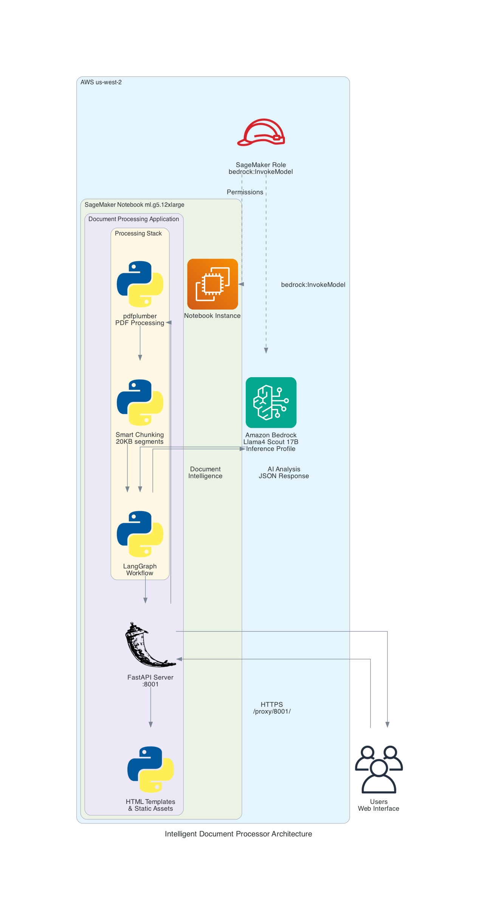

# Intelligent Document Processor

Document analysis application using Amazon Bedrock Llama4 Scout on Amazon SageMaker.

Run the code below in a terminal or use the llama-4-scout-document-processing Jupyter notebook.

## Architecture Overview



## Components

- **Frontend**: HTML interface with file upload
- **Backend**: FastAPI application
- **AI Model**: Amazon Bedrock Llama4 Scout via inference profile
- **Infrastructure**: SageMaker notebook instance
- **Processing**: Document parsing with text chunking
- **PDF Engine**: pdfplumber for PDF text extraction

## Prerequisites

- AWS Account with SageMaker and Bedrock access
- SageMaker notebook instance with Bedrock permissions
- IAM role configured for Bedrock access

## Setup Instructions

### 1. Create SageMaker Notebook Instance

- Instance type: ml.g5.12xlarge
- Platform: Amazon Linux 2, Jupyter Lab 3
- IAM role: SageMaker execution role with Bedrock permissions

### 2. Upload and Extract Project

1. Git clone 
2. Extract:

```bash
cd /home/ec2-user/SageMaker
unzip Llama4-LangGraph-GitHub.zip
cd Llama4-LangGraph-GitHub/
```

### 3. Install Dependencies

```bash
pip install -r requirements.txt
```

### 4. Start Application

```bash
python3 run_dev.py
```

### 5. Access Application

URL: `https://YOUR-NOTEBOOK-NAME.notebook.us-west-2.sagemaker.aws/proxy/8001/`

Replace `YOUR-NOTEBOOK-NAME` with your SageMaker notebook instance name.

## Technical Details

- **Frontend**: HTML template served by FastAPI
- **Backend**: FastAPI on port 8001
- **AI**: Amazon Bedrock Llama4 Scout
- **Processing**: Text chunking for large documents (20KB chunks)
- **PDF Processing**: pdfplumber library
- **Supported Formats**: PDF, DOCX, TXT, MD

## Features

- File upload interface
- Document text extraction
- Text chunking for large documents
- Llama4 Scout analysis with optimized prompts
- JSON response format
- SageMaker deployment

## Usage

1. Start the application: `python3 run_dev.py`
2. Access via SageMaker proxy URL
3. Upload document using web interface
4. View analysis results

## Document Processing

- Documents over 20KB are automatically chunked
- PDF text extraction using pdfplumber
- Analysis using Llama4 Scout with structured prompts

## Project Structure

```
├── main.py                 # FastAPI application
├── llm_providers.py        # Bedrock integration
├── document_processor.py   # Document processing workflow
├── document_parsers.py     # File parsing (PDF, DOCX, TXT, MD)
├── simple_workflow.py     # Text chunking and analysis
├── models.py              # Pydantic data models
├── run_dev.py             # Development server launcher
├── requirements.txt       # Python dependencies
├── templates/
│   └── index.html         # Web interface
├── static/               # Static files directory
└── README.md             # Documentation
```

## Troubleshooting

**Inference profile error**: Use `us.meta.llama4-scout-17b-instruct-v1:0`

**Bedrock access denied**: Verify SageMaker execution role has Bedrock permissions

**PDF processing issues**: pdfplumber handles most PDFs; convert to text if needed

**Large documents**: Automatic chunking applies to documents over 20KB

## Output Format

The application returns JSON with:

- Document summary and type classification
- Key insights and findings
- Action items with priorities
- Entity extraction (names, dates, amounts, locations, organizations)
- Q&A pairs
- Risk and opportunity analysis

## Implementation Notes

- Uses optimized Llama4 Scout prompt formatting with proper tokens
- No external dependencies or API keys required
- SageMaker-native deployment using IAM role credentials
- Text chunking with 500-character overlap for large documents
- Fallback error handling for JSON parsing

## Dependencies

See `requirements.txt` for complete list. Key dependencies:
- fastapi
- uvicorn
- boto3
- pdfplumber
- python-docx
- jinja2

---

**Amazon Bedrock + SageMaker Document Processing**