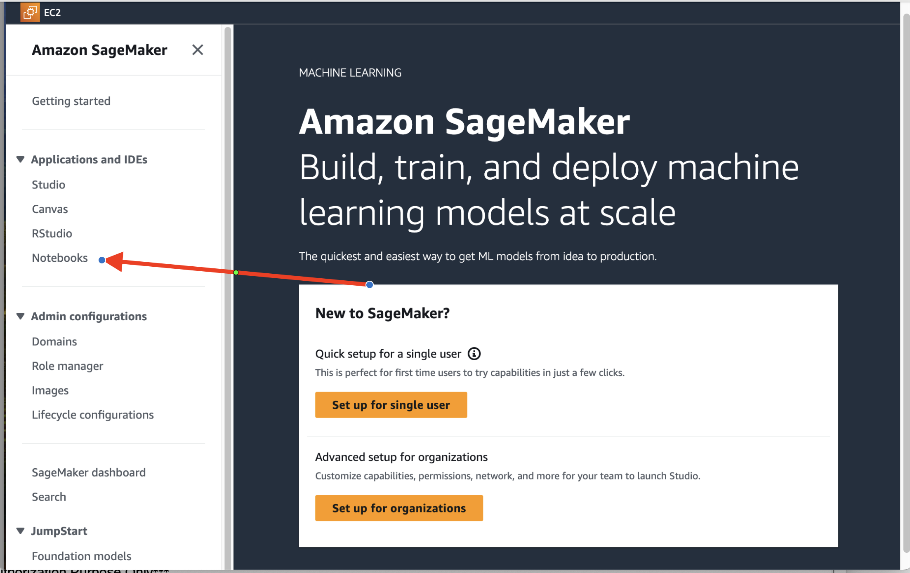
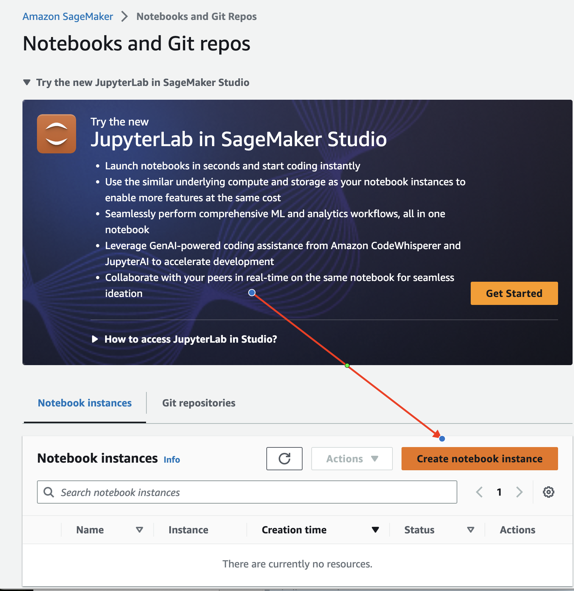
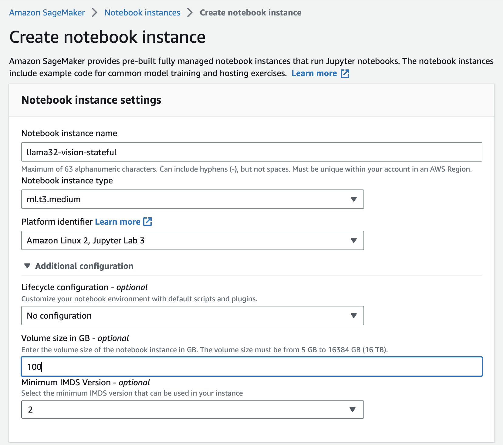
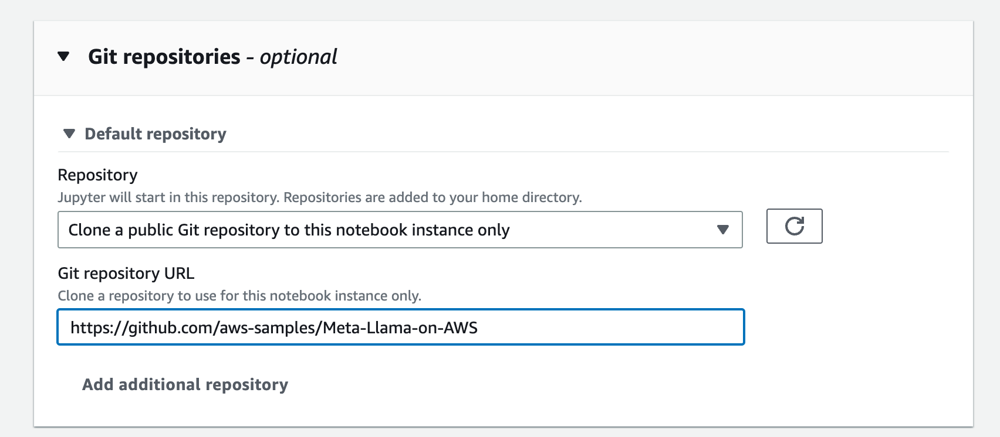
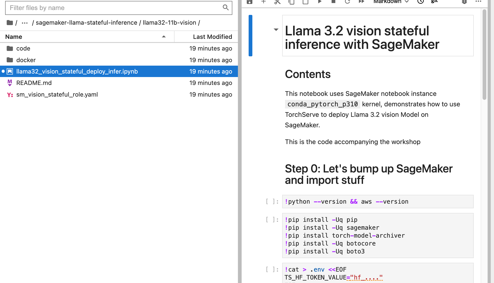

# Stateful inference using SageMaker endpoints

This is an example of how customers can leverage sticky routing feature in Amazon SageMaker to achieve stateful model Inference, when using Llama 3.2 vision model.

we will use Llama 3.2 vision model to upload a image and then ask questions about the image without having to resend the image for every request. The image is cached CPU memory.

We will be using TorchServe as our model server for this example.

## Steps to create the notebook

### Create role to run this notebook

Use the following code to deploy an AWS CloudFormation stack that creates an AWS Identity and Access Management (IAM) role to deploy the SageMaker endpoints:

```bash
aws cloudformation create-stack --stack-name sm-vision-stateful-role \
--template-body https://raw.githubusercontent.com/aws-samples/sagemaker-genai-hosting-examples/refs/heads/main/Llama3/llama3-11b-vision/stateful/sm_vision_stateful_role.yaml \
--capabilities CAPABILITY_NAMED_IAM \
--region us-west-2
```

### Create a SageMaker notebook instance

Complete the following steps to create a notebook instance :

1. On the SageMaker console, choose Notebooks in the navigation pane.

1. Choose Create notebook instance.

1. In the Notebook instance settings section, under Additional configuration, choose at least 100 GB for the storage volume.

1. In the Permissions and encryption section, choose to use an existing IAM role, and choose the role you created in the prerequisites (sm_vision_stateful_role-xxx).
You can get the full name of the role on the AWS CloudFormation console, on the Resources tab of the stack sm_vision_stateful_role.
1. In the Git repositories section, for Git repository URL, enter `https://github.com/aws-samples/Meta-Llama-on-AWS`

1. Choose Create notebook instance.

### Run the notebook

When the notebook is ready, complete the following steps:

1. On the SageMaker console, choose Notebooks in the navigation pane.
1. Choose Open JupyterLab for this new instance.

1. In JupyterLab, you will see the file explorer on the left.
1. Navigate to sagemaker-llama-stateful-inference/llama32-11b-vision/ and open the notebook llama32_vision_stateful_deploy_infer.ipynb.

1. Run the notebook
