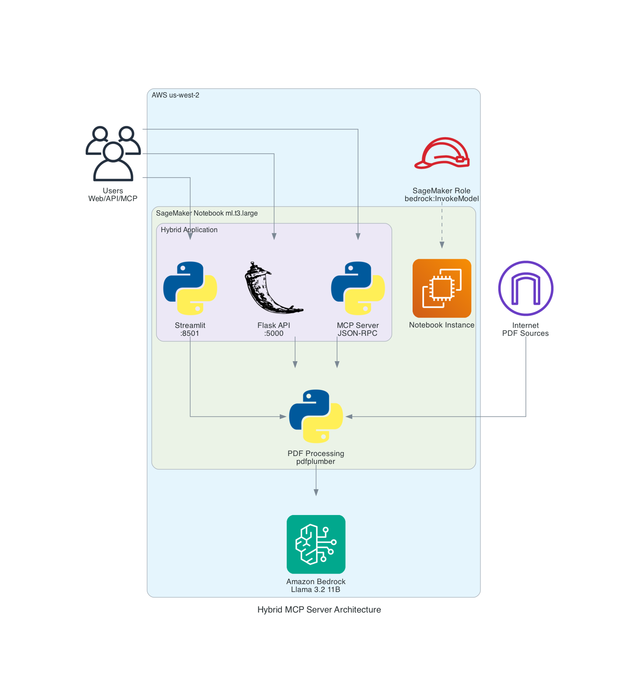

# Hybrid PDF Document Analyzer - SageMaker Notebook Instance

AI-powered PDF document analyzer that extracts text and answers questions using AWS Bedrock Llama 3.2 11B. Deploy on SageMaker with three different access methods.

## Three Interface Architecture

1. **Streamlit Web UI** - Direct human interaction with file upload and URL input
2. **Flask HTTP API** - RESTful web service for application integration  
3. **MCP Server** - Model Context Protocol for AI assistant tool integration

## Files
- `hybrid_flask_mcp.py` - Hybrid Flask + MCP server
- `streamlit_app.py` - Streamlit frontend interface  
- `bedrock_call.py` - Bedrock API call handler
- `requirements.txt` - Python dependencies
- `README.md` - Setup instructions

## Architecture



```
PDF URL → Streamlit (port 8501) → Flask HTTP (port 5000) → bedrock_call.py → AWS Bedrock → Response
PDF URL → AI Tool → MCP JSON-RPC → bedrock_call.py → AWS Bedrock → Response
```

Three interfaces, same powerful backend - now running on SageMaker!

## SageMaker Setup

### 1. Create SageMaker Notebook Instance
- **Instance type:** `ml.t3.large`
- **Region:** `us-west-2` (required for Bedrock Llama 3.2 11B)
- **Volume size:** 5 GB (default)
- **IAM role:** Create role with Bedrock permissions (see IAM Role Policy section below)

### 2. Upload Project Files
1. Zip this project folder
2. In Jupyter, click "Upload" and select the zip file
3. Open terminal: New → Terminal
4. Extract files:
```bash
cd /home/ec2-user/SageMaker
unzip HybridAppMCPSagemakerNotebook.zip
```

### 3. Install Dependencies
```bash
# Core dependencies
pip install flask boto3 pdfplumber requests werkzeug

# Streamlit (use conda to avoid PyArrow issues - may take 1-4 minutes)
conda install -c conda-forge streamlit
```

### IAM Role Policy

**Important:** You must attach this policy to the **SageMaker notebook instance role**, not your personal user account.

- User attaches policy to the **SageMaker notebook instance role**
- App runs with the **notebook instance's role credentials**
- User's personal IAM permissions **don't matter** for the app

Create a policy with the following permissions and attach it to your SageMaker notebook instance role:

```json
{
	"Version": "2012-10-17",
	"Statement": [
		{
			"Effect": "Allow",
			"Action": [
				"bedrock:InvokeModel"
			],
			"Resource": "*"
		}
	]
}
```

**Note:** Only `bedrock:InvokeModel` is required since the app uses a hardcoded Llama 3.2 11B model ID.

## Running the Application

### Start Both Services (2 Terminals Required)

**Terminal 1 - Flask + MCP Server:**
```bash
cd /home/ec2-user/SageMaker
python3 hybrid_flask_mcp.py
```

**Terminal 2 - Streamlit Frontend:**
```bash
cd /home/ec2-user/SageMaker
streamlit run streamlit_app.py --server.address=0.0.0.0 --server.port=8501
```

### Alternative Running Options (Single Terminal)

**Flask Web API Only (no Streamlit UI):**
```bash
python3 hybrid_flask_mcp.py --flask-only
```
*Access via: `https://[notebook-name].notebook.us-west-2.sagemaker.aws/proxy/5000/health`*

**MCP Server Only (for AI assistants):**
```bash
python3 hybrid_flask_mcp.py --mcp-only
```
*Communicates via stdin/stdout JSON-RPC protocol*

## How to Access Your Running App

Replace `[notebook-name]` with your SageMaker notebook instance name:

- **Streamlit Web Interface:** `https://[notebook-name].notebook.us-west-2.sagemaker.aws/proxy/8501/`
- **Flask API Health Check:** `https://[notebook-name].notebook.us-west-2.sagemaker.aws/proxy/5000/health`
- **MCP Protocol:** stdin/stdout JSON-RPC (AI tools)

**Example:** If your notebook is named `HybridAppMCP`:
- Streamlit: `https://HybridAppMCP.notebook.us-west-2.sagemaker.aws/proxy/8501/`
- Flask API: `https://HybridAppMCP.notebook.us-west-2.sagemaker.aws/proxy/5000/health`

## Testing Web App Workflow

1. **Go to:** `https://[notebook-name].notebook.us-west-2.sagemaker.aws/proxy/8501/`
2. **Enter PDF URL:** `https://soarworks.samhsa.gov/sites/default/files/media/documents/2023-05/MSR%20Sample%20Active%20Substance%20Use%202023.pdf`
3. **Ask question:** "What is this document about?"
4. **Click:** "Analyze Document"

## Testing API Directly

**Health Check:**
```bash
curl https://[notebook-name].notebook.us-west-2.sagemaker.aws/proxy/5000/health
```

**Local API Test (from SageMaker terminal):**
```bash
curl -X POST http://localhost:5000/analyze \
  -H "Content-Type: application/json" \
  -d '{"source": "https://soarworks.samhsa.gov/sites/default/files/media/documents/2023-05/MSR%20Sample%20Active%20Substance%20Use%202023.pdf", "question": "What is this document about?", "is_url": true}'
```

## Testing MCP Server

**First, navigate to the project directory:**
```bash
cd /home/ec2-user/SageMaker/HybridAppMCPSagemakerNotebook
```

**Test tool discovery:**
```bash
echo '{"jsonrpc": "2.0", "id": 1, "method": "tools/list"}' | python3 hybrid_flask_mcp.py --mcp-only
```

**Test PDF analysis:**
```bash
echo '{"jsonrpc": "2.0", "id": 2, "method": "tools/call", "params": {"name": "analyze_pdf_url", "arguments": {"url": "https://example.com/doc.pdf", "question": "What is this about?"}}}' | python3 hybrid_flask_mcp.py --mcp-only
```

## Troubleshooting

**Streamlit Installation Issues:**
- Use `conda install -c conda-forge streamlit` instead of pip
- This avoids PyArrow/CMake dependency conflicts on SageMaker

**Access Issues:**
- Ensure both Flask and Streamlit are running in separate terminals
- Use SageMaker proxy URLs, not localhost URLs from external browsers
- Check that your notebook instance is in `us-west-2` region

Three interfaces, same powerful backend - now running on SageMaker!

## **MCP Server Information**

This application implements a **legitimate Model Context Protocol (MCP) server** that can be used for document analysis solutions. While not production-ready out of the box, it demonstrates an architecture that can be evolved into enterprise-grade deployments.

### What is MCP?

**Model Context Protocol (MCP)** is a standard for AI tools to communicate with AI assistants using JSON-RPC protocol over stdin/stdout. This allows AI assistants like Claude and ChatGPT to use your PDF analyzer as a tool.


### MCP Implementation Details

This is a **lightweight, custom MCP implementation** built with pure Python standard library:

- **`json`** - Parsing JSON-RPC messages
- **`sys.stdin`** - Reading MCP requests
- **`sys.stdout`** - Sending MCP responses  
- **`threading`** - Concurrent Flask and MCP operation

**No external MCP dependencies required!** The implementation follows the MCP specification exactly:

```python
def mcp_server():
    """MCP server loop running in background thread."""
    for line in sys.stdin:
        try:
            request = json.loads(line.strip())
            method = request.get("method")
            # Handle tools/list and tools/call
            # Send JSON-RPC response
        except:
            pass
```

### MCP Protocol Compliance

✅ **Tool Discovery** - Handles `tools/list` method  
✅ **Tool Execution** - Handles `tools/call` method  
✅ **JSON-RPC Format** - Correct request/response structure  
✅ **Standard Communication** - Uses stdin/stdout like official MCP servers  
✅ **Protocol Specification** - Follows MCP standard exactly  

### Communication Example

```json
# AI assistant request:
{"jsonrpc": "2.0", "method": "tools/call", "params": {"name": "analyze_pdf_url", "arguments": {"url": "...", "question": "..."}}}

# Your app response:
{"jsonrpc": "2.0", "result": {"content": [{"type": "text", "text": "Document analysis..."}]}}
```

### Deployment Model

**Private/Internal Deployment:**
- **Self-hosted** - Runs in your own AWS account
- **Data sovereignty** - Documents never leave your infrastructure  
- **Custom access control** - IAM roles, VPC, security groups
- **Cost controlled** - Pay only for usage
- **Security foundation** - Runs in customer's own AWS environment

**Ideal for:**
- Enterprises with sensitive documents
- Research institutions with proprietary papers  
- Government agencies with classified materials
- Healthcare organizations requiring HIPAA compliance
- Legal firms with confidential case files

### Private Deployment Benefits

**Key Differences from Public MCP Servers:**
- **Data sovereignty** - Documents processed in your own AWS account
- **Custom control** - Modify and extend functionality as needed
- **No external dependencies** - Pure Python implementation
- **Private infrastructure** - Runs entirely within your organization

### Evolution Path to Enterprise Production

This implementation can be evolved into a full enterprise solution by adding:

- Production infrastructure (ECS/EKS, load balancing)
- Authentication and authorization systems
- Comprehensive logging and monitoring
- Security scanning and compliance controls
- CI/CD pipelines and configuration management

**Current Status:** Proof of Concept → **Next:** Pilot/Demo → **Future:** Enterprise Production

**Perfect for:** Proof of concept, pilot programs, individual/small team use