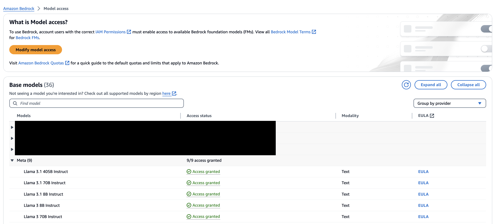

# Meta Llama 3 Advanced Prompting Techniques

This repository contains the notebook demonstrated the advanced prompting techniques with the following Llama models:

- Meta Llama 3.1 405B
- Meta Llama 3.1 70B
- Meta Llama 3.1 8B
- Meta Llama 3 70B
- Meta Llama 3 8B

In the notebook, we will utilize Meta Llama model on [**Amazon Bedrock**](https://aws.amazon.com/bedrock/), as such the notebook can be run on a simple `t3.medium` instance using the `Data Science 3.0` kernel. This notebook is tested on **us-west-2 (Oregon)** region.

## Amazon Bedrock 

Amazon Bedrock is a fully managed service that provides access to high-performing foundation models (FMs) from leading AI companies like AI21 Labs, Anthropic, Cohere, Meta, Mistral AI, Stability AI, and Amazon through a single API.

## Prerequisites

Before using this notebook, you will need to gain access to Meta Llama foundation model. You can done this on Amazon Bedrock console, and Model access tab.

## Pricing

There will be some charging if you are using this notebook on your AWS account. Please refer to our AWS [website](https://aws.amazon.com/bedrock/pricing/) for Meta Llama model pricing.

## Security

See [CONTRIBUTING](CONTRIBUTING.md#security-issue-notifications) for more information.

## License

This library is licensed under the MIT-0 License. See the LICENSE file.

