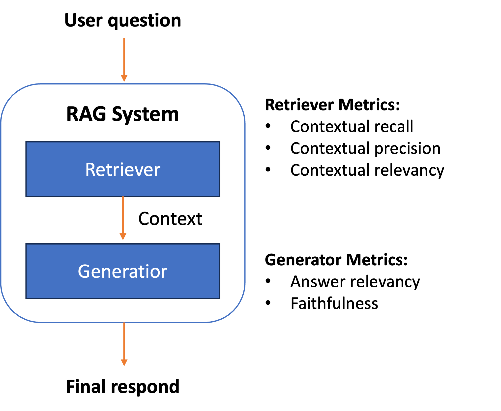

# DeepEval

## Introduction

[**DeepEval**](https://docs.confident-ai.com/) is an open-source evaluation framework for LLMs. DeepEval makes it extremely easy to build and iterate on LLM (applications). It is designed to address the complex challenges of evaluating **Retrieval-Augmented Generation (RAG)** systems. Developed to meet the growing demand for robust assessment tools in the field of AI-powered information retrieval and generation, `DeepEval` offers a comprehensive suite of metrics and methodologies. This framework enables developers, researchers, and data scientists to rigorously test, benchmark, and optimize their RAG applications. By providing automated, scalable, and customizable evaluation processes, DeepEval streamlines the often complex task of assessing RAG performance across multiple dimensions, including retrieval accuracy, generation quality, and contextual relevance. 

## Objectives
In this repository, we will demonstrate how to use **DeepEval** framework to evaluate RAG application. You can decoupling the testing for **retrieval** and **generation** components of RAG. With this, the researchers, or developers can assess, and pinpoint the components independently and make iterative improvement faster.

## Pricing
Given we will be using Amazon Bedrock as our main LLM and evaluator LLM, please refer to [Amazon Bedrock Pricing page](https://aws.amazon.com/bedrock/pricing/).