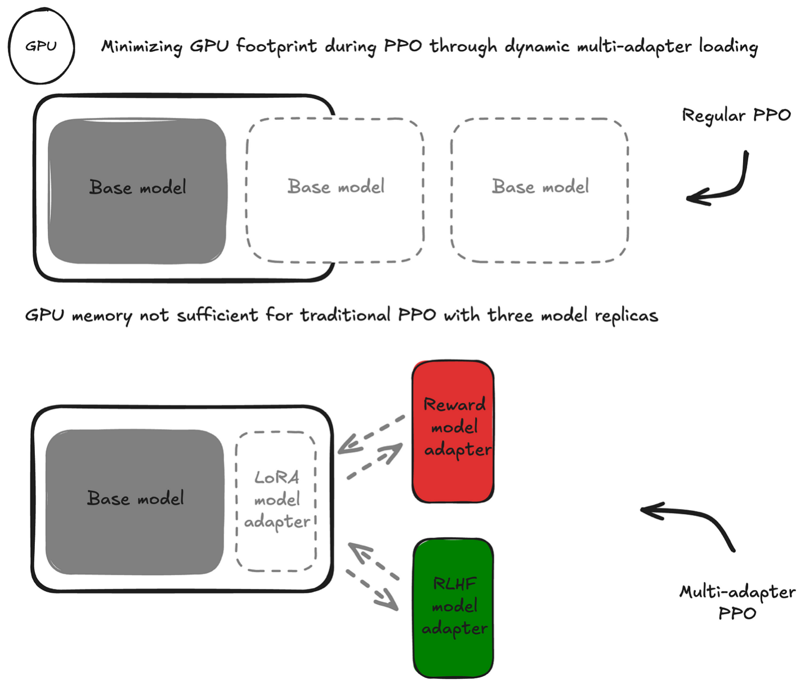

# Frugal Reinforcement Learning from Human Feedback (RLHF) with Meta Llama models

## Workshop Overview

This workshop guides you through the process of fine-tuning Large Language Models (LLMs) using Reinforcement Learning from Human Feedback (RLHF) with a multi-adapter Proximal Policy Optimization (PPO) approach. The workshop focuses on preference alignment of Meta Llama models, making efficient use of resources while achieving high-quality results.

### What You'll Learn

In this tutorial, you will:

1. Set up the necessary environment and dependencies
2. Prepare datasets for both reward model training and PPO fine-tuning
3. Train a reward model using human preference data
4. Perform PPO-based RLHF training using your reward model
5. Deploy the fine-tuned model to both Amazon SageMaker AI and Amazon Bedrock for inference
6. Clean up resources

More information on LLM fine-tuning, benefits of reinforcement learning approaches like RLHF and the benefits of multi-adapter PPO can be found in [this blogpost](https://medium.com/data-science/preference-alignment-for-everyone-2563cec4d10e).

## Prerequisites

Before starting, you need to:

1. Create a [HuggingFace](https://huggingface.co/) account (or use your existing one).
2. Accept the license terms for [Meta Llama 3.1 8B](https://huggingface.co/meta-llama/Llama-3.1-8B-Instruct) and [Meta Llama 3.2 1B](https://huggingface.co/meta-llama/Llama-3.2-1B-Instruct) Instruct models on HuggingFace.
3. Create an access token for HuggingFace authentication following the [HuggingFace documentation](https://huggingface.co/docs/hub/en/security-tokens).

## Model Selection

The workshop allows you to choose between:
- **Meta Llama-3.1-8B-Instruct**: More powerful but requires more compute resources (training with ml.g5.12xlarge)
- **Meta Llama-3.2-1B-Instruct**: Smaller model, faster training, lower resource requirements (training with ml.g5.2xlarge or ml.p3.2xlarge)

Choose the model that best fits your available compute resources. For workshop settings with limited time or resources, the 1B model is recommended.

## Workshop Architecture

The multi-adapter approach uses:
- One base model (Meta Llama)
- Two adapter sets:
  - Policy Adapter: The model being optimized through RL
  - Reward Adapter: Our trained model that evaluates response quality

## Workshop Contents

The Jupyter notebook `rlhf-multi-adapter-ppo.ipynb` contains the complete workshop with the following key sections:

1. **Environment Setup**: Installing dependencies and setting up AWS resources
2. **Data Preparation**: Processing human preference data for reward modeling and creating prompt datasets
3. **Reward Model Training**: Training a model to learn from human preferences
4. **PPO Training**: Fine-tuning the model using the trained reward model
5. **Model Deployment**: Deploying the fine-tuned model to Amazon SageMaker and Amazon Bedrock
6. **Resource Cleanup**: Removing all created resources to avoid unnecessary costs

## Getting Started

To begin the workshop:

1. Clone this repository
2. Open the `rlhf-multi-adapter-ppo.ipynb` notebook in a Jupyter environment
3. Follow the step-by-step instructions in the notebook

## Requirements

- Python 3.10+
- PyTorch 2.1.0+
- Transformers 4.36.0+
- TRL (Transformer Reinforcement Learning)
- Access to AWS services (SageMaker, S3, Bedrock)
- GPU instances for training (ml.g5.2xlarge recommended minimum)

## License

This workshop uses Meta Llama models, which require acceptance of Meta's license terms. Please ensure you have accepted these terms on HuggingFace before beginning the workshop.